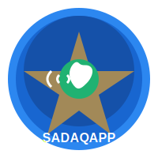

# SADAQAPP – The Voice-First, Inclusive Financial Aid Platform



## 📋 Project Overview

SADAQAPP is a Shariah-compliant fintech platform designed to help low-income users with limited digital and financial literacy manage finances, request aid, and make donations through an inclusive, voice-first interface. The platform enables:

- **Beneficiaries**: Submit aid requests for Zakah/Sadaqah with voice guidance
- **Donors**: Browse verified aid requests and contribute directly to those in need
- **Transparency**: Every transaction is recorded on a simulated blockchain ledger
- **Education**: Access to Islamic finance and financial literacy resources

This low-code prototype demonstrates the core user flows, interfaces, and interactions using Next.js, with a focus on accessibility, beautiful UI design, and voice-first interactions.

## 🚀 Quick Start

### Prerequisites

- Node.js 18.17.0 or later
- npm or yarn package manager

### Installation

1. Clone the repository:
   ```bash
   git clone https://github.com/Ahm-edAshraf/SADAQAPP.git
   cd SADAQAPP
   ```

2. Install dependencies:
   ```bash
   npm install
   # or
   yarn install
   ```

3. Run the development server:
   ```bash
   npm run dev
   # or
   yarn dev
   ```

4. Open [http://localhost:3000](http://localhost:3000) in your browser to see the application.

## 🗺️ Application Routes & Pages

### Authentication & Onboarding
- **Home**: `/` - Landing page with platform introduction
- **Authentication**: `/auth` - Entry point for registration/login
- **Registration**: `/auth/register` - Phone-based registration with OTP
- **Login**: `/auth/login` - Login with phone number and OTP
- **Role Selection**: `/auth/role-selection` - Choose between beneficiary or donor

### Beneficiary Flow
- **Beneficiary Dashboard**: `/beneficiary` - Overview of aid requests and status
- **Aid Request Form**: `/beneficiary/request` - Submit new aid requests

### Donor Flow
- **Donor Dashboard**: `/donor` - Browse aid requests and donation opportunities
- **Request Detail**: `/donor/request/[id]` - Detailed view of an aid request
- **Donation Confirmation**: `/donor/confirmation` - Success page after donation

### Blockchain & Transparency
- **Blockchain Ledger**: `/blockchain` - Transparent record of all transactions

### Educational & Settings
- **Financial Education**: `/education` - Educational resources on Islamic finance
- **Settings**: `/settings` - Accessibility and application preferences
- **Help & FAQ**: `/help` - Common questions and support resources
- **User Profile**: `/profile` - User information and transaction history

## ✨ Key Features

### Voice-First Interaction
- Voice guidance throughout the application
- Text-to-speech for important content and notifications
- Toggle voice features in settings

### Accessibility
- High contrast mode
- Large text options
- Screen reader compatibility
- Reduced motion settings

### Shariah Compliance
- Clear distinction between Zakah and Sadaqah
- Proper categorization of aid requests based on Islamic principles
- Transparency in donation allocation

### User Experience
- Beautiful, responsive design for all devices
- Smooth animations and transitions
- Intuitive navigation
- Consistent voice guidance

### Blockchain Transparency
- Simulated blockchain ledger for transaction transparency
- Each transaction has a unique ID, timestamp, and hash
- Full transaction history visible to users

## 🛠️ Technology Stack

- **Frontend Framework**: Next.js 15 (React 19)
- **UI Components**: Material UI (MUI) v7
- **Styling**: CSS-in-JS with Emotion and styled-components
- **Animations**: Framer Motion
- **Voice Interface**: Web Speech API (simulated)
- **Form Handling**: Native React forms with client-side validation
- **Routing**: Next.js App Router
- **Mock Data**: Static JSON and in-memory storage

## 🔊 Voice & Accessibility Features

SADAQAPP is designed with a voice-first approach, ensuring usability for users with limited digital literacy or visual impairments:

- **Text-to-Speech**: Automatic reading of important content
- **Voice Commands**: Navigate the app using voice (simulated in prototype)
- **Accessibility Settings**:
  - Toggle voice features on/off
  - Adjust text size
  - Enable high contrast mode
  - Reduce animations
- **ARIA Compliance**: Fully accessible to screen readers
- **Keyboard Navigation**: Complete keyboard support

## 🌟 Mock Demonstration Data

For the prototype, we use mock data to simulate the full functionality:

- **Demo Users**:
  - Beneficiary: Phone: `+123456789`, OTP: `123456`
  - Donor: Phone: `+987654321`, OTP: `654321`
- **Aid Requests**: Pre-populated requests with various needs and amounts
- **Transactions**: Mock blockchain entries for demonstration
- **Educational Content**: Sample financial literacy materials

## 🔮 Future Enhancements (Final Round)

For the final round, we plan to enhance the prototype with:

### Technical Improvements
- **Backend Integration**: Replace mock data with real API endpoints
- **Real Database**: MongoDB integration for persistent storage
- **Enhanced Voice Commands**: More comprehensive voice interaction patterns
- **Progressive Web App (PWA)**: Offline capabilities and home screen installation
- **Payment Gateway Integration**: Simulated payment processing

### Feature Additions
- **Recurring Donations**: Allow donors to set up monthly contributions
- **Impact Tracking**: Show beneficiaries how donations have helped them
- **Community Forum**: Allow users to share experiences and advice
- **Chat Support**: In-app support chat with voice interface
- **Notifications System**: Push notifications for important updates
- **Multi-language Support**: Arabic, Urdu, and other languages

### Enhanced Analytics
- **Donation Analytics**: Visual representations of donation impact
- **Need Assessment**: AI-powered suggestion of aid amounts based on need
- **Fraud Detection**: Systems to ensure legitimate aid requests


For questions or feedback, please contact:
- Email: ahamed111215@gmail.com
- GitHub: [Ahm-edAshraf](https://github.com/Ahm-edAshraf)

## 📄 License

This project is for demonstration purposes only. All rights reserved.

---

*SADAQAPP - Connecting those who can give with those in need, through technology that's accessible to all.* 